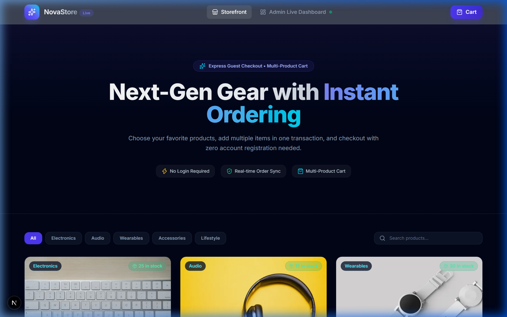
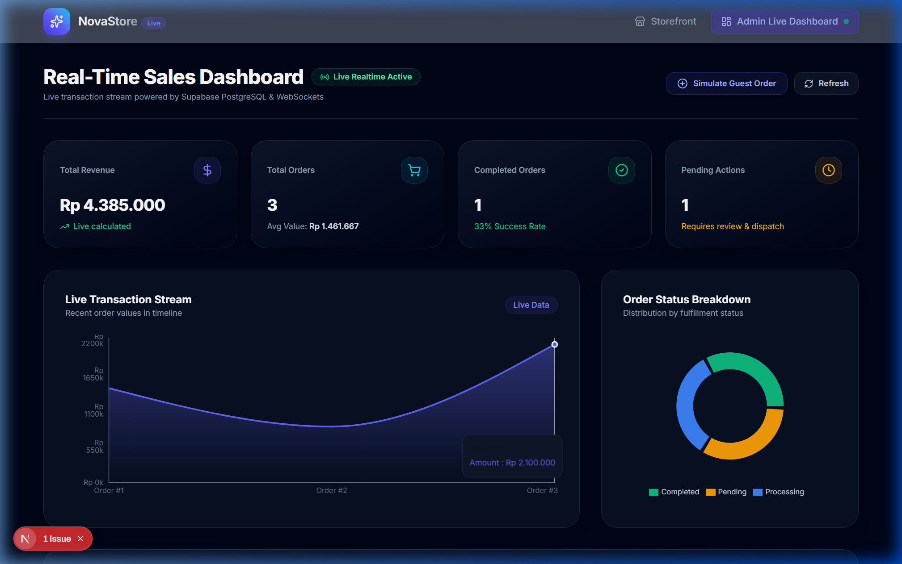
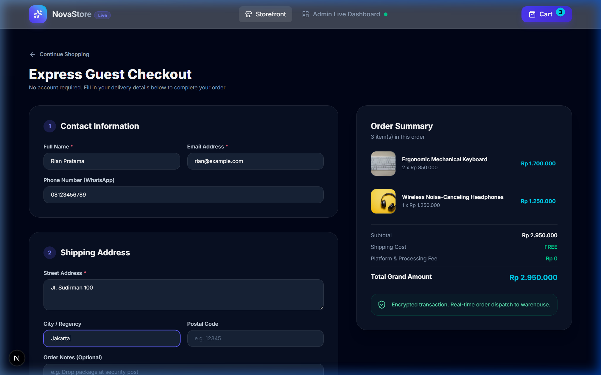
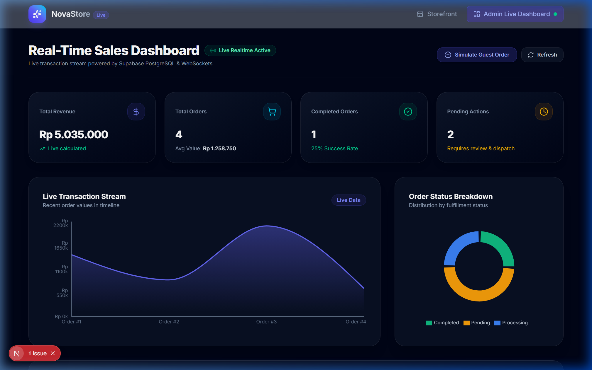
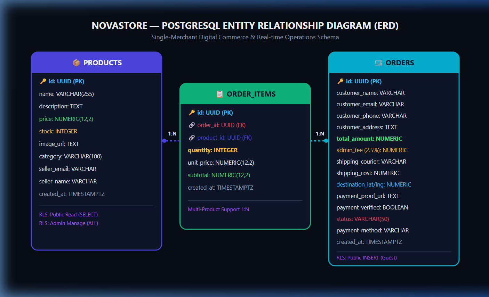
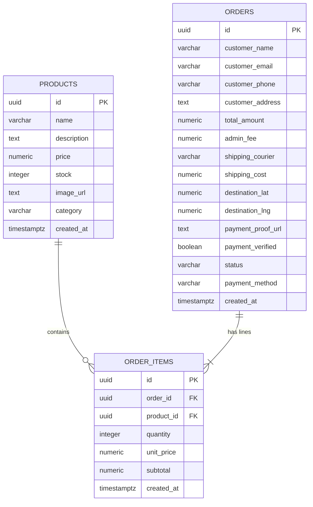
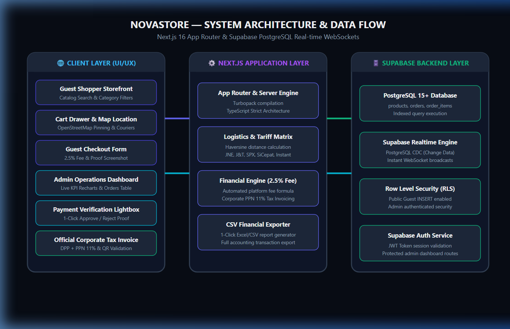

# 🛒 NovaStore — Mini E-Commerce & Real-time Operations Dashboard

[](https://nextjs.org/)
[](https://react.dev/)
[](https://www.typescriptlang.org/)
[](https://supabase.com/)
[](https://tailwindcss.com/)
[](https://shop.sourcecodejournal.dev)

NovaStore is an enterprise-grade digital commerce platform built for single-merchant operations. It provides a **frictionless guest checkout experience** for customers while equipping store administrators with a **real-time operations dashboard** powered by Supabase PostgreSQL WebSockets.

🌐 **Live Production App:** [https://shop.sourcecodejournal.dev](https://shop.sourcecodejournal.dev)  
📑 **Interactive Documentation:** [`docs/User Documentation-Azmi.html`](docs/User%20Documentation-Azmi.html)

---

## 📸 Visual Previews

| Customer Storefront | Real-Time Admin Dashboard |
| :---: | :---: |
|  |  |

| Guest Checkout & Map Geolocation | Live WebSocket Push Notification |
| :---: | :---: |
|  |  |

---

## 🌟 Key Features

### 1. 🛍️ Customer Storefront & Guest Checkout
- **Frictionless Multi-Product Checkout**: Zero login or registration barrier. Customers can browse, select multiple different products, adjust custom quantities, and place consolidated orders.
- **Dual-Layer Real-Time Stock Engine**: Purchased quantities automatically deduct from both Supabase cloud database and local fallback caches with instant multi-tab WebSocket updates.
- **Interactive Map Geolocation**: Pin precise delivery coordinates on OpenStreetMap or click **"Use GPS"** for automatic geolocation.
- **Multi-Courier Shipping Engine**: Dynamic distance-based tariff estimation across domestic and international services (**JNE Express, J&T Express, Shopee Xpress, SiCepat, Instant Bike, DHL Express, FedEx, UPS**).
- **Automated 2.5% Administrative Fee**: Itemized service fee calculation (`Math.round(cartTotal * 0.025)`) displayed transparently across checkout, confirmation receipts, and corporate invoices.
- **Direct-to-Seller Payment Verification**:
  - **Instant QRIS (0% MDR Fee)** with payment receipt screenshot upload.
  - **Direct Bank Transfer (BCA, Mandiri)** with screenshot proof upload.
  - **Cash on Delivery (COD)** upon arrival.

### 2. ⚡ Real-Time Operations & Admin Command Center
- **Live WebSocket Orders & Inventory Monitor**: Bi-directional real-time subscriptions on both `orders` and `products` tables with instant visual/auditory alerts.
- **Visual Analytics & KPI Metrics**: Total revenue, order count, completed vs. pending fulfillment rates, and average order value (AOV) rendered with interactive Recharts.
- **Payment Proof Verification Center**: Inspect uploaded payment receipt screenshots in full-resolution lightbox and 1-click **Approve** (moves to `processing`) or **Reject** (`cancelled` with automatic stock restitution).
- **1-Click Database Reset Modes**:
  - **Mode 1 (Clear Orders)**: Cleanly deletes order items and orders to zero (0 orders) without affecting the product catalog.
  - **Mode 2 (Pristine Restore)**: Cascade reset restoring all 6 flagship products and 3 starter demo orders without foreign key constraint errors.
- **Product Catalog CRUD**: Complete inventory management (Add, Edit, Delete with modern custom glassmorphism modal dialogs — zero native browser popups).
- **Financial Reporting**: 1-click CSV/Excel export for accounting and financial auditing.
- **Official Commercial Tax Invoices**: Dedicated `/invoice/[id]` route featuring DPP + 11% PPN breakdown, courier dispatch info, administrative fees, and verified scannable QR verification code.

---

## 🗄️ Database Architecture (ERD)





---

## 🏗️ System Architecture & Workflow



```
[ Customer Storefront ] ──> [ Cart & Map Location Engine ] ──> [ Guest Checkout ]
                                                                       │
                                                                       ▼
[ Admin Dashboard ] <─── [ Supabase Realtime WebSockets ] <─── [ PostgreSQL Database ]
```

---

## 🔑 Demo Admin Credentials

For technical reviewers and interview evaluation:
- **Admin Portal**: [`/admin/login`](https://shop.sourcecodejournal.dev/admin/login)
- **Demo Email**: `admin@novastore.com`
- **Demo Password**: `admin12345`
- **Or Click**: **⚡ Instant Demo Admin Access** (1-click entry)

---

## 🚀 Getting Started Locally

### 1. Clone the Repository & Install Dependencies
```bash
git clone https://github.com/<YOUR_GITHUB_USERNAME>/mini-ecommerce-dashboard.git
cd mini-ecommerce-dashboard
npm install
```

### 2. Configure Environment Variables
Create a `.env.local` file in the root directory:
```env
NEXT_PUBLIC_SUPABASE_URL=https://your-project-id.supabase.co
NEXT_PUBLIC_SUPABASE_ANON_KEY=your-anon-publishable-key
```

### 3. Setup Database Schema in Supabase
1. Open your **[Supabase SQL Editor](https://supabase.com/dashboard)**.
2. Copy and execute the contents of [`supabase/schema.sql`](supabase/schema.sql) (or [`supabase/reset_database.sql`](supabase/reset_database.sql)).

### 4. Run the Local Development Server
```bash
npm run dev
```
Open [http://localhost:3000](http://localhost:3000) in your browser.

---

## 📖 Submission Documentation Index

All required technical test documentation is available in the [`docs/`](docs/) directory:

| Document | Description |
| :--- | :--- |
| **[`docs/User Documentation-Azmi.html`](docs/User%20Documentation-Azmi.html)** | **Complete Interactive Submission Document with Inlined ERD & Architecture SVGs, Math Formulas, and UI Screenshots** |
| **[`docs/PRD_AND_ERD.md`](docs/PRD_AND_ERD.md)** | Product Requirement Document & Mermaid Entity Relationship Diagram |
| **[`docs/SYSTEM_FLOWCHART.md`](docs/SYSTEM_FLOWCHART.md)** | System Architecture Diagram, Sequence Diagram, & Fulfillment State Machine |
| **[`docs/AI_PROMPT_LOG.md`](docs/AI_PROMPT_LOG.md)** | Comprehensive AI Prompt Logs, Engineering Iterations & Workflow History |
| **[`docs/SCREENSHOTS.md`](docs/SCREENSHOTS.md)** | Non-Technical UI Visual Walkthrough & Screenshots |

---

## ⚖️ Database Constraints & Free Tier Optimization
- **Row Level Security (RLS)**: Strictly enables public inserts for guest orders while reserving administrative queries and mutations for authenticated sessions.
- **Indexed Queries**: Performance indexes on `orders(created_at DESC)`, `orders(status)`, and `products(category)`.
- **Lightweight Assets**: Unsplash optimized image CDN URLs and minimal media storage overhead.
