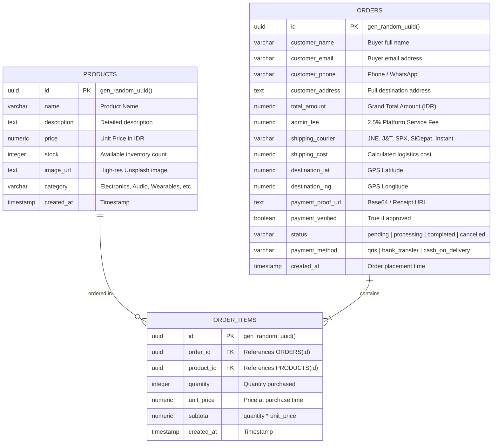

# Product Requirement Document (PRD) & Entity Relationship Diagram (ERD)

## 1. Executive Summary & Product Overview
**Project Title:** NovaStore Mini E-Commerce & Real-time Operations Dashboard  
**Business Domain:** Digital Retail, Consumer Electronics & Lifestyle Flagship Store  
**Mission:** Deliver a frictionless, ultra-fast guest shopping experience paired with an enterprise-grade, real-time administrative command center for live order tracking, financial reconciliation, and logistics dispatch.

---

## 2. Target Personas & Core User Flows
1. **Public Customer (Guest Shopper):**
   - No registration or login barrier.
   - Browse catalog with live search and category filters.
   - Multi-product shopping cart with dynamic quantity adjustments.
   - Pinpoint GPS delivery location on an interactive map.
   - Dynamic multi-courier shipping selection (JNE, J&T, SPX, SiCepat, Instant).
   - Real-time 2.5% administrative service fee calculation.
   - Zero-fee Instant QRIS, Bank Transfer with receipt screenshot upload, or Cash on Delivery (COD).
   - Instant order confirmation and scannable corporate tax invoice.

2. **Store Operations Officer & Financial Administrator:**
   - Secure authentication via Supabase Auth or 1-click Demo Admin access.
   - Real-time live orders monitor powered by Supabase PostgreSQL WebSockets.
   - Interactive financial analytics charts (Revenue trends, Order status distribution, AOV).
   - Payment proof inspection center with full-resolution zoom lightbox and 1-click Approve / Reject.
   - Full product catalog inventory CRUD (Create, Read, Update, Delete with modern confirmation modal).
   - 1-click CSV / Excel export for accounting reports.
   - Live order simulation tool for instant real-time demonstration.

---

## 3. Financial & Logistics Engine

### 3.1 Fee & Tax Computation Formula
$$\text{Product Subtotal} = \sum (\text{Price} \times \text{Quantity})$$
$$\text{Shipping Tariff} = \text{Base Cost} + (\text{Distance in KM} \times \text{Tariff per KM})$$
$$\text{Admin Fee (Biaya Layanan 2.5\%)} = \text{Round}(\text{Product Subtotal} \times 0.025)$$
$$\text{Grand Total} = \text{Product Subtotal} + \text{Shipping Tariff} + \text{Admin Fee}$$

$$\text{DPP (Dasar Pengenaan Pajak)} = \text{Round}\left(\frac{\text{Product Subtotal}}{1.11}\right)$$
$$\text{PPN 11\%} = \text{Product Subtotal} - \text{DPP}$$

---

## 4. Entity Relationship Diagram (ERD)

---

## 5. Security & Row Level Security (RLS) Policies
- **`public.products`**: Read access granted to `public`; mutations granted to authenticated admins.
- **`public.orders`**: `INSERT` open for public guest checkout; `SELECT` and `UPDATE` granted for store administration and real-time WebSocket publications.
- **`public.order_items`**: `INSERT` open for public checkout items; `SELECT` enabled for verified invoices and dashboard order detail inspections.
