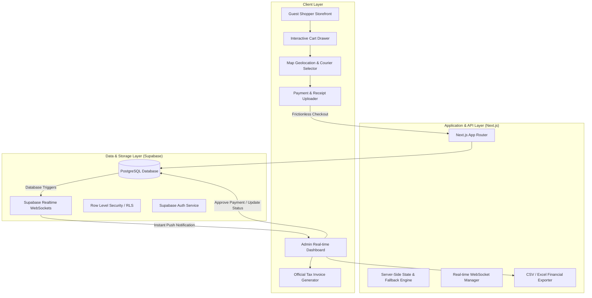
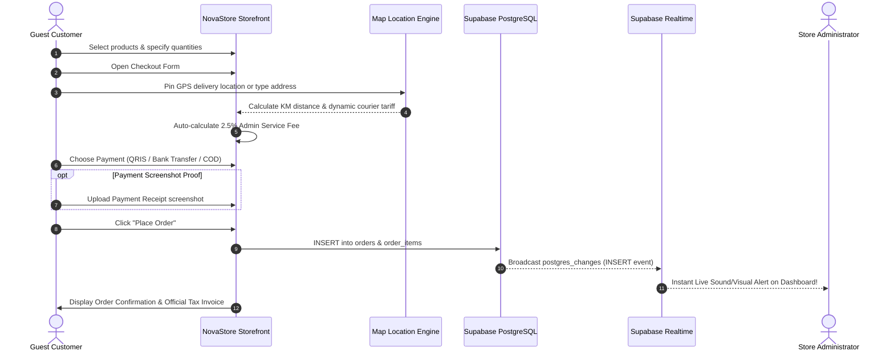
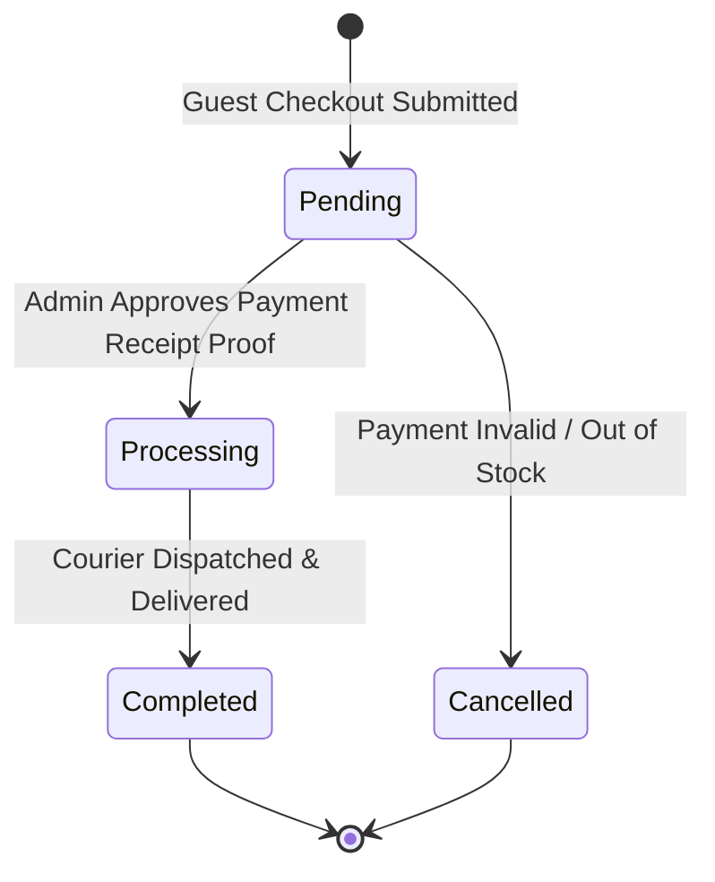

# System Architecture & Flowcharts

## 1. High-Level Architecture Overview

NovaStore operates as a modern cloud-native single-merchant digital commerce platform using **Next.js (App Router)** and **Supabase (PostgreSQL, Realtime Engine, Auth)**.

---

## 2. Guest Customer Checkout & Payment Workflow

---

## 3. Real-time Order Verification & Fulfillment Lifecycle

