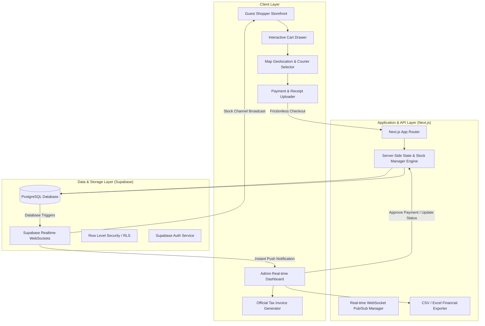
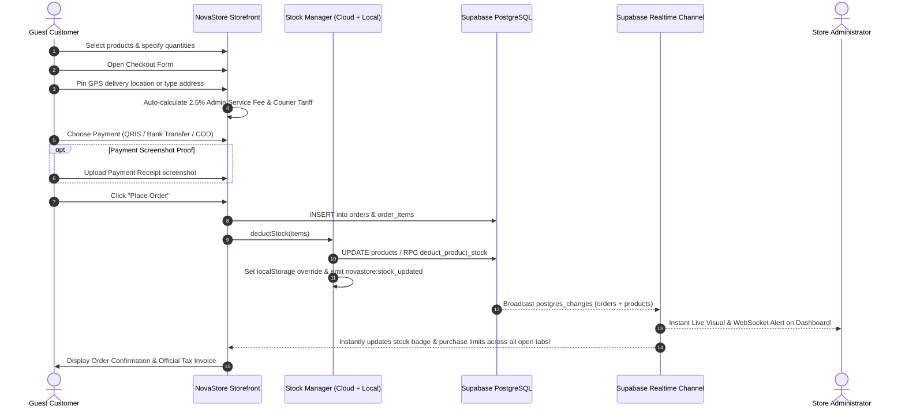
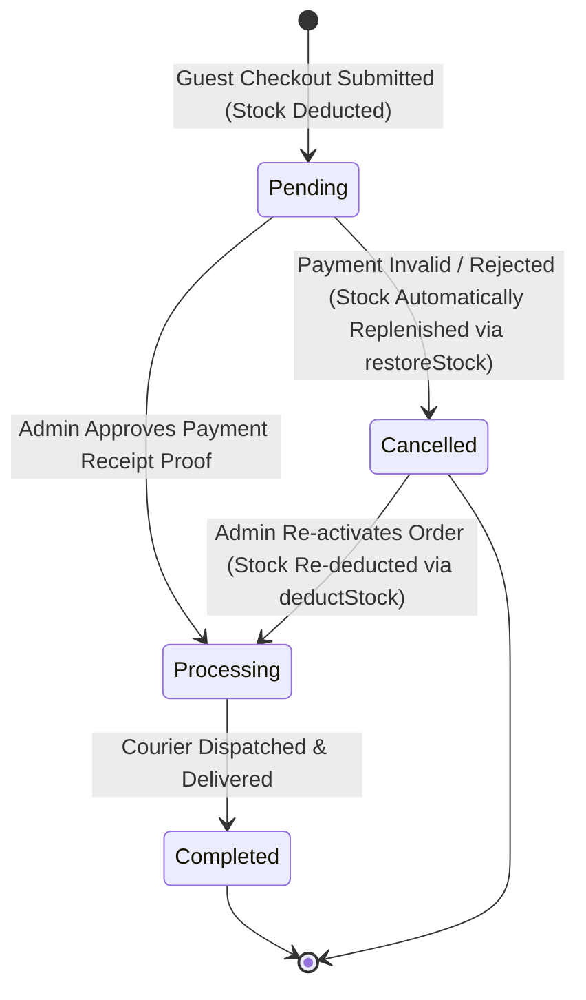
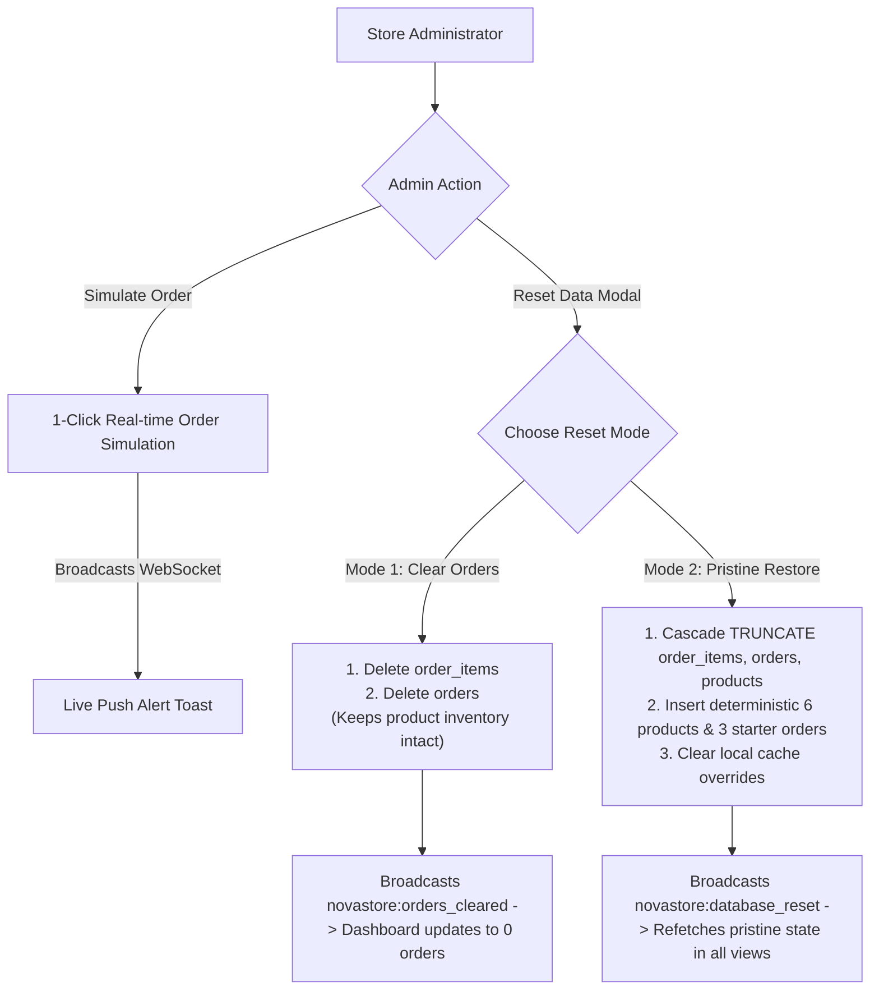
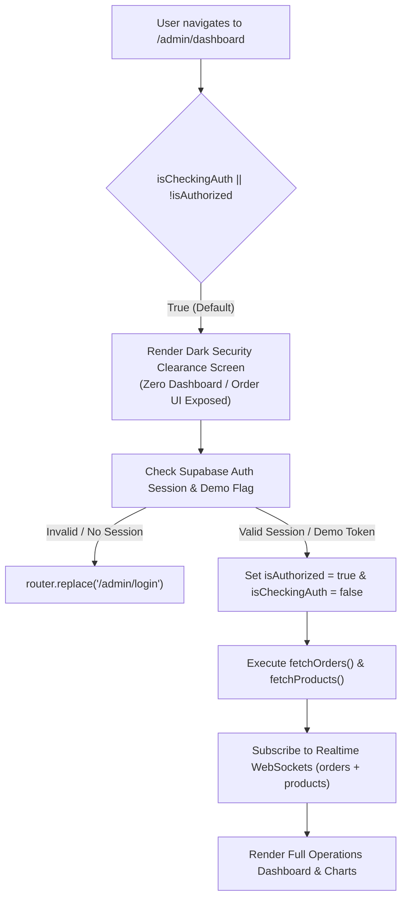
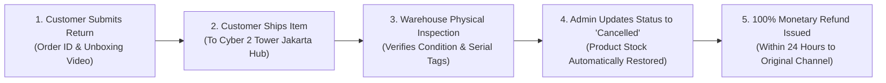
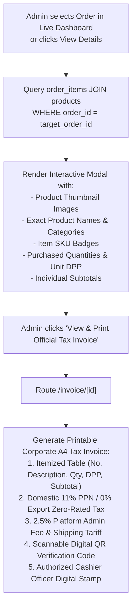

# System Architecture & Flowcharts

## 1. High-Level Architecture Overview

NovaStore operates as a modern cloud-native single-merchant digital commerce platform using **Next.js (App Router)** and **Supabase (PostgreSQL, Realtime Engine, Auth)**.

---

## 2. Dual-Layer Guest Customer Checkout & Inventory Sync Workflow

---

## 3. Real-time Order Verification & Inventory Lifecycle

---

## 4. Store Operations & Cascade-Safe Database Reset Architecture

---

## 5. Zero-Flash Admin Authentication Guard Flow

---

## 6. Customer Return & Refund (RMA) Lifecycle Flow

---

## 7. Itemized Product Details & Tax Invoice Inspection Flow

